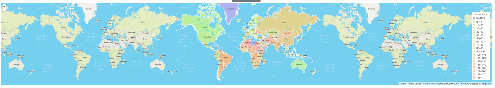
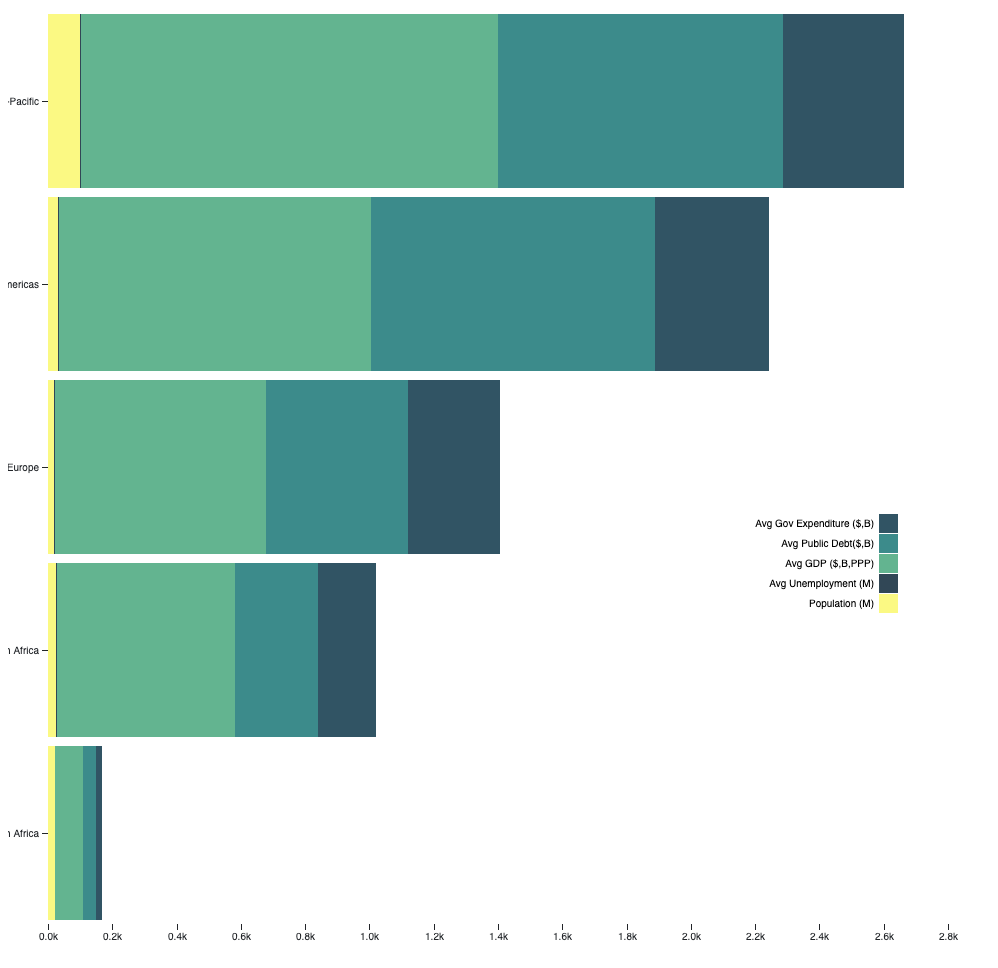
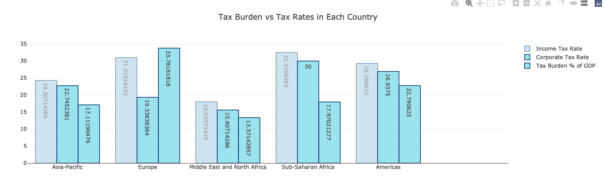
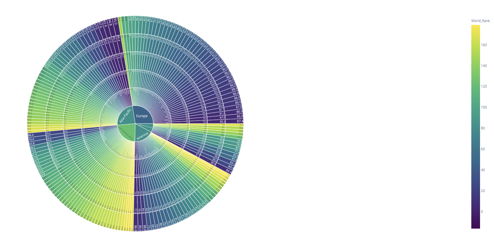

# Economic-Freedom-Project

Authors | Grace, Kara, Lisa, Michael

## Table of Contents
* [Objective](#Objective)
* [Data](#Data)
* [Technologies](#Technologies)
* [Process](#Process)
* [Deployment](#Deployment)
* [Visualization](#Visualization)

# Objective | 

The Economic Freedom Index tracks the advancements in global prosperity and shares patterns of success in over 180 countries.  Because of the global crisis we currently face, the most vulnerable have been made even more so.  By evaluating this data, we hope to find positive trends that can be shared with the United Nations’ Economic and Social Council.  Some of the relationships we intend to explore include:
* Fiscal Health of Countries/Regional Outliers(?) - Michael
* Tax Burden Percentage of GDP and Corporate/income tax Rate- Kara
* Unemployment compared to government Expenditure,  public debt, population - Grace
* Comparisons between various “freedoms” - Lisa

# Data | 

https://www.kaggle.com/lewisduncan93/the-economic-freedom-index/data#

The data (last updated 26/02/2019) is presented in CSV format as follows: CountryID, Country Name, WEBNAME, Region, World Rank, Region Rank, 2019 Score, Property Rights, Judical Effectiveness, Government Integrity, Tax Burden, Gov't Spending, Fiscal Health, Business Freedom, Labor Freedom, Monetary Freedom, Trade Freedom, Investment Freedom, Financial Freedom, Tariff Rate (%), Income Tax Rate (%), Corporate Tax Rate (%), Tax Burden % of GDP, Gov't Expenditure % of GDP , Country, Population (Millions), "GDP (Billions, PPP)", GDP Growth Rate (%), 5 Year GDP Growth Rate (%), GDP per Capita (PPP), Unemployment (%), Inflation (%), FDI Inflow (Millions), Public Debt (% of GDP).

# Technologies |

* Leaflet.js
* Postgres SQL
* D3
* Plot.ly
* Python
* Pandas
* HTML
* CSS
* Javascript

# Process |

* Python/Pandas - finding interesting data and/or verifying the data you’re planning on displaying is interesting. “What data should I display to the end user and how do I need to clean it?”
* Visualization analysis - the end user after you’ve already done the cleaning and editing. “What cool stories can I let the end user discover with this clean and beautiful data?”
* Data Queries - SQL - “ETL”
* Website for display - HTMl/CSS
* Create Visualizations

# Visualizations | 

